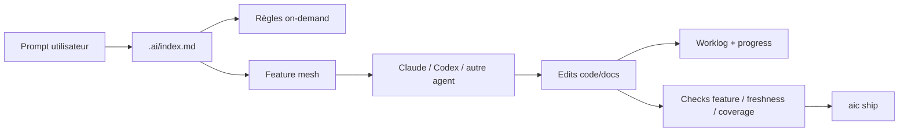

# ai_context

Le template qui rend les agents IA plus fiables sur un repo réel sans promettre
la même automatisation partout : Claude Code est le runtime le plus intégré,
Codex est le pilote multi-agent le mieux outillé après Claude, et les autres
agents s'appuient surtout sur `AGENTS.md`, les hooks git et les checks.

`README.md` est la porte d'entrée canonique du repo source. Le fichier
`README_AI_CONTEXT.md` est le guide rendu dans les projets consommateurs ; il
montre le résultat du template, mais ne remplace pas cette page pour comprendre
ou maintenir `ai_context`.

`ai_context` installe une couche de contexte versionnée dans ton projet :
instructions agents, feature mesh, worklogs, hooks, checks, skills `aic-*` et
commandes CLI. L'objectif est simple : un agent doit comprendre quoi faire, où
reprendre, quels fichiers sont liés à quelle feature, et quand il peut vraiment
dire "c'est prêt".

## Pourquoi l'utiliser

Sans structure, les agents IA dérivent vite :

- ils relisent trop de fichiers ou pas les bons ;
- ils oublient les décisions prises dans les sessions précédentes ;
- ils modifient du code sans mettre la doc feature à jour ;
- ils valident trop tôt, sans preuve ;
- chaque repo finit avec un `CLAUDE.md` ou `AGENTS.md` différent.

`ai_context` remplace cette improvisation par un protocole léger, repo-native et
testé.

| Ce que tu veux | Ce que le template installe |
|---|---|
| Une entrée agent standard sans duplication | `AGENTS.md` auto-suffisant + `.ai/index.md` lean, avec shims/imports dérivés selon l'agent |
| Reprendre une feature sans redemander l'historique | fiches `.docs/features/<scope>/<id>.md` + worklogs append-only |
| Eviter le contexte géant | Pack A lean, règles on-demand, mesure de coût tokens |
| Relier code, doc, commit et review | `touches:`, `depends_on`, checks feature, freshness staged |
| Utiliser Claude et Codex avec le même langage | surface `aic` : frame, pilot, status, diagnose, document-feature, review, ship |
| Garder un projet mature propre | hooks git, checks CI, doctor, smoke-test, migration Copier |

## Pour qui

`ai_context` est utile si tu as :

- un projet qui va durer plus que quelques prompts ;
- plusieurs features en parallèle ;
- Claude Code, Codex, Cursor, Gemini ou Copilot sur le même repo ;
- une équipe qui veut que les agents suivent les mêmes règles ;
- un besoin de traçabilité entre décisions produit, docs et code.

Ce n'est pas un outil de roadmap, ni un remplaçant de Linear/Jira/BMAD/Spec Kit.
C'est la couche locale qui permet aux agents de travailler proprement avec ces
artefacts.

## Démarrage rapide

Prérequis :

```bash
pip install --user copier
brew install jq yq
```

Scaffold :

```bash
copier copy gh:qhuy/ai_context ./mon-projet
cd mon-projet
git init
git add -A
git commit -m "chore: installer ai_context"
```

Activer les hooks git si le mode choisi les génère :

```bash
git config core.hooksPath .githooks
chmod +x .githooks/*
```

Vérifier l'installation :

```bash
bash .ai/scripts/check-shims.sh
bash .ai/scripts/check-features.sh
bash .ai/scripts/check-feature-docs.sh
bash .ai/scripts/aic.sh frame "première tâche"
```

`aic.sh frame` donne un bootstrap de contexte. Pour un cadrage critique ou durable, utiliser le skill `/aic-frame`. Pour un audit général ou un suivi transverse, utiliser `/aic-pilot`.

Dans Claude Code, lance ensuite `/hooks` et active les hooks proposés si tu veux
l'injection de contexte automatique à chaque tour.

## Le workflow quotidien

La surface utilisateur canonique est `aic`.

| Besoin | Claude | Codex / terminal |
|---|---|---|
| Cadrer avant d'écrire | `/aic-frame` | `bash .ai/scripts/aic.sh frame "<objectif>"` pour bootstrap |
| Initialiser ou migrer l'overlay projet | `/aic-onboard` | skill local `aic-onboard` |
| Piloter un audit ou suivi transverse | `/aic-pilot` | skill local `aic-pilot` |
| Structurer le développement | `/aic-dev-plan` | skill local `aic-dev-plan` |
| Savoir où reprendre | `/aic-status` | `bash .ai/scripts/aic.sh status` |
| Diagnostiquer un blocage | `/aic-diagnose` | `bash .ai/scripts/aic.sh diagnose "<symptôme>"` |
| Charger le contexte d'un fichier | `/aic-document-feature` | `bash .ai/scripts/aic.sh document-feature <path>` |
| Relire le delta courant | `/aic-review` | `bash .ai/scripts/aic.sh review` |
| Préparer commit / PR | `/aic-ship` | `bash .ai/scripts/aic.sh ship` |

Flux recommandé :

```text
frame -> feature doc -> implémentation -> review -> ship -> commit
pilot -> item actif -> frame/feature/fix/docs/handoff -> validation -> item suivant
```

En langage naturel, ça donne :

```text
Cadre cette feature, crée la fiche si nécessaire, implémente, teste, puis prépare le ship.
```

L'agent doit garder un scope primaire. Si le travail sort du scope, il produit un
handoff explicite au lieu de mélanger les responsabilités.

## Ce que le template génère

Selon les agents, scopes et modes choisis :

```text
mon-projet/
├── AGENTS.md / CLAUDE.md / GEMINI.md
├── .ai/
│   ├── index.md                  # entrée canonique, chargement lean
│   ├── context-ignore.md         # exclusions de contexte Codex/on-demand
│   ├── rules/<scope>.md          # règles courtes par scope
│   ├── workflows/*.md            # procédures agent-agnostic
│   ├── agent/*.md                # posture/diagnostic/style, on-demand
│   ├── scripts/*.sh              # checks, aic CLI, hooks, reports
│   └── schema/feature.schema.json
├── .agents/skills/aic-*          # skills Codex locaux si codex est sélectionné
├── .claude/skills/aic-*          # skills Claude si claude est sélectionné
├── .claude/settings.json         # hooks Claude Code
├── .codex/hooks.json             # hooks Codex natifs si enable_codex_hooks=true
├── .githooks/                    # commit-msg, pre-commit, post-checkout
├── .github/workflows/            # CI optionnelle
└── .docs/
    ├── FEATURE_TEMPLATE.md
    └── features/<scope>/
        ├── <id>.md               # fiche feature + frontmatter
        └── <id>.worklog.md       # journal append-only
```

## Comment ça marche



Le principe :

1. `AGENTS.md` donne l'entrée standard et les règles dures suffisantes.
2. `.ai/index.md` reste la source de contexte lean chargée juste-à-temps.
3. Les shims dérivés importent ou pointent vers `AGENTS.md` selon l'agent.
4. Les fichiers ciblés déclenchent la recherche des fiches feature liées.
5. Les worklogs gardent la mémoire entre sessions.
6. Les hooks et checks empêchent les commits incohérents.
7. `aic` sert de langage commun entre humain, Claude, Codex et terminal.

## Honnêteté runtime

Tous les agents ne reçoivent pas le même niveau d'automatisation.

| Capacité | Claude Code | Codex | Cursor | Gemini | Copilot |
|---|---|---|---|---|---|
| Entrée racine (AGENTS.md ou shim dédié) | `CLAUDE.md` (@AGENTS.md) | `AGENTS.md` natif | `AGENTS.md` natif | `GEMINI.md` (@AGENTS.md) | `AGENTS.md` natif (coding agent) ; shim opt-in pour Chat/review |
| Git hooks et checks au commit | Oui | Oui | Oui | Oui | Oui |
| Skills `aic-*` locaux | Oui | Oui, si `codex` sélectionné | Non | Non | Non |
| Injection automatique au début du tour | Oui | Opt-in (`enable_codex_hooks`) | Non | Non | Non |
| Injection feature avant édition | Oui | Manuel via `aic.sh document-feature` | Partiel via `.mdc` scopés (back/front) | Non | Non |
| Gate de fraîcheur doc en fin de tour | Oui | Opt-in (`enable_codex_hooks`) | Non | Non | Non |
| Auto-worklog en fin de tour | Oui | Non | Non | Non | Non |
| Auto-progression `spec -> implement` au commit | Oui | Oui | Oui | Oui | Oui |

Conclusion pragmatique :

- Claude Code a l'expérience la plus automatisée.
- Codex s'en rapproche avec `enable_codex_hooks=true` : reminder injecté à chaque
  tour et gate de fraîcheur en fin de turn via `.codex/hooks.json` (hooks natifs,
  trust de la couche projet demandé au premier lancement). L'auto-worklog reste
  Claude-only. Sans hooks : skills locaux, `.ai/index.md` et `aic.sh`.
- Cursor et Copilot lisent `AGENTS.md` nativement : leurs shims dédiés ne sont
  plus générés par défaut (registre `.ai/native-context-support.tsv`) ; Cursor
  garde les `.mdc` scopés par globs, Copilot un shim compat opt-in
  (`enable_copilot_shim`) pour Chat/review IDE.
- Tous les agents bénéficient des règles, hooks git et checks.

## Contrats multi-agent

Les capacités avancées restent opt-in et gouvernées par `.ai/rules/workflow.md` :

- Subagents : déléguer seulement avec rôle clair (`explorer` lecture seule, `worker` avec write-set explicite), sortie structurée et aucun cross-scope sans HANDOFF.
- Hooks Codex : pilote déterministe opt-in — `.codex/hooks.json` généré si `enable_codex_hooks=true` (reminder par tour + gate de fraîcheur, contrat `.ai/workflows/codex-hooks-parity.md`) ; les hooks Git et checks `.ai/scripts/*` restent la garantie stable.
- MCP : aucun serveur par défaut ; allowlist explicite, pas de secrets, source des données annoncée et fallback sans MCP.

## Feature mesh

Une feature est un fichier Markdown versionné :

```yaml
---
id: auth-session
scope: back
title: Session JWT + refresh token
status: active
depends_on: []
touches:
  - src/auth/**
progress:
  phase: implement
  step: "service layer"
  blockers: []
  resume_hint: "reprendre sur src/auth/service.ts"
  updated: 2026-05-06
---
```

Ce frontmatter permet aux scripts de répondre à des questions que les agents
ratent souvent :

- quel contexte charger pour `src/auth/service.ts` ?
- quelles features sont impactées par ce diff ?
- quelles docs doivent être dans le même commit ?
- qu'est-ce qui est bloqué, stale, done ou à reprendre ?

## Modes d'adoption

| Mode | Quand l'utiliser |
|---|---|
| `lite` | Tu veux seulement les shims, `.ai/`, les scripts et les docs, sans hooks git ni CI. |
| `standard` | Recommandé. Git hooks + CI optionnelle + hooks Claude si Claude est sélectionné. |
| `strict` | Projet déjà mature. CI forcée, `doctor --strict`, coverage strict. Peut rendre un jeune repo rouge. |

## Profils disponibles

Scopes :

| Profil | Scopes générés |
|---|---|
| `minimal` | core, quality, workflow, product |
| `backend` | minimal + back, architecture, security, handoff |
| `fullstack` | backend + front |
| `custom` | minimal, puis ajout manuel |

Presets techniques :

| Profil | Ajout |
|---|---|
| `generic` | aucune règle stack spécifique |
| `dotnet-clean-cqrs` | règles .NET Clean Architecture + CQRS |
| `react-next` | règles React / Next |
| `fullstack-dotnet-react` | règles .NET + React + contrats back/front |

## Installer sur un projet existant

Ne copie pas le template directement dans un repo mature sans preview.

```bash
cd mon-projet
git checkout -b codex/install-ai-context

rm -rf /tmp/ai-context-preview
copier copy gh:qhuy/ai_context /tmp/ai-context-preview \
  --data project_name=mon-projet \
  --data scope_profile=backend \
  --data docs_root=.docs

diff -qr /tmp/ai-context-preview . | less
```

Copie en priorité les scripts, hooks, quality gate et templates. Fusionne
manuellement les shims, règles locales et features existantes.

Guide complet : [MIGRATION.md](MIGRATION.md).

## Mettre à jour le template

```bash
copier update --vcs-ref=HEAD --conflict=rej
```

`--conflict=rej` garde les scripts exécutables sans marqueurs `<<<<<<<` inline ; inspecte les `.rej` avant commit.

Si `.copier-answers.yml` manque :

```bash
bash .ai/scripts/aic.sh repair-copier-metadata
bash .ai/scripts/aic.sh repair-copier-metadata --apply
```

Pour estimer une update sans toucher au worktree courant :

```bash
bash .ai/scripts/aic.sh template-diff
```

Guide complet : [docs/upgrading.md](docs/upgrading.md).

## Checks utiles

| Commande | Rôle |
|---|---|
| `bash .ai/scripts/check-shims.sh` | vérifie que les shims restent minces et pointent vers `.ai/index.md` |
| `bash .ai/scripts/check-agent-config.sh` | vérifie les configs Claude/Codex et scripts de hooks référencés |
| `bash .ai/scripts/check-features.sh` | valide frontmatter, scopes, `depends_on`, `touches` |
| `bash .ai/scripts/check-feature-docs.sh` | vérifie les sections obligatoires des fiches |
| `bash .ai/scripts/check-feature-freshness.sh --staged --strict` | bloque si code stage sans fiche/worklog stage |
| `bash .ai/scripts/check-feature-coverage.sh` | détecte les fichiers non couverts par une feature |
| `bash .ai/scripts/check-product-links.sh` | valide les initiatives `product` et leurs liens |
| `bash .ai/scripts/measure-context-size.sh` | mesure le coût du contexte injecté |
| `bash .ai/scripts/doctor.sh` | diagnostic installation |
| `bash tests/smoke-test.sh` | test end-to-end du template |

## Variables d'environnement

| Variable | Effet |
|---|---|
| `AI_CONTEXT_DEBUG=1` | logs debug des hooks |
| `AI_CONTEXT_SHOW_ALL_STATUS=1` | inclut `done`, `deprecated`, `archived` dans le reminder |
| `AI_CONTEXT_FOCUS=<scope>` | réduit l'inventaire au scope + voisins 1-hop |
| `AI_CONTEXT_DOCS_ROOT=<dir>` | override du dossier de docs métier |

## FAQ

**Faut-il documenter tout le code dès le départ ?**

Non. Tu peux adopter progressivement. `check-feature-coverage.sh --warn` liste
les orphelins. Passe en `--strict` seulement quand le mesh couvre suffisamment le
projet.

**Est-ce que ça marche sans Claude ?**

Oui. Codex peut recevoir le reminder par tour et le gate de fraîcheur en fin de
turn via `enable_codex_hooks=true` (hooks natifs `.codex/hooks.json`, trust de la
couche projet au premier lancement). Les autres agents ont les shims, règles,
git hooks, checks et scripts `aic.sh`. Claude ajoute l'injection feature avant
édition et l'auto-worklog.

**Pourquoi ne pas tout mettre dans `AGENTS.md` ou `CLAUDE.md` ?**

Parce que ces fichiers grossissent vite et deviennent chers en tokens. Ici, les
shims restent minces. `AGENTS.md` porte l'entrée standard et les règles dures ;
`.ai/index.md` charge le reste juste-à-temps.

**Où mettre les règles spécifiques à mon projet ?**

Dans `.ai/project/index.md` et les fichiers qu'il référence. Ce dossier est
project-owned et n'est pas écrasé par `copier update`.

**Comment éviter une roadmap parallèle ?**

Le scope `product` ne remplace pas ton outil produit. Il relie initiative,
références externes, features dev, evidence et prochaine décision.

**Le template supporte-t-il les monorepos ?**

Oui. Utilise `docs_root=docs` si nécessaire et crée des scopes adaptés
(`back-api`, `back-worker`, `front-web`, etc.).

## Documentation

- [README_AI_CONTEXT.md](README_AI_CONTEXT.md) - guide généré dans les projets consommateurs ; dans ce repo source, `README.md` reste l'entrée canonique
- [docs/getting-started.md](docs/getting-started.md) - démarrage détaillé
- [MIGRATION.md](MIGRATION.md) - migration brownfield
- [docs/upgrading.md](docs/upgrading.md) - updates Copier
- [docs/variables.md](docs/variables.md) - variables Copier
- [CHANGELOG.md](CHANGELOG.md) - versions et breaking changes
- [PROJECT_STATE.md](PROJECT_STATE.md) - état et roadmap mainteneur

## Contribuer

Pour modifier le template :

```bash
bash tests/smoke-test.sh
```

Règles mainteneur :

- un sous-chantier = un commit ;
- commits en français ;
- si un script existe dans `.ai/scripts/` et `template/.ai/scripts/`, modifier les deux ;
- ne pas grossir Pack A sans raison.

Voir aussi :

- [CONTRIBUTING.md](CONTRIBUTING.md)
- [SECURITY.md](SECURITY.md)
- [RELEASE.md](RELEASE.md)

## Licence

MIT - voir [LICENSE](LICENSE).
