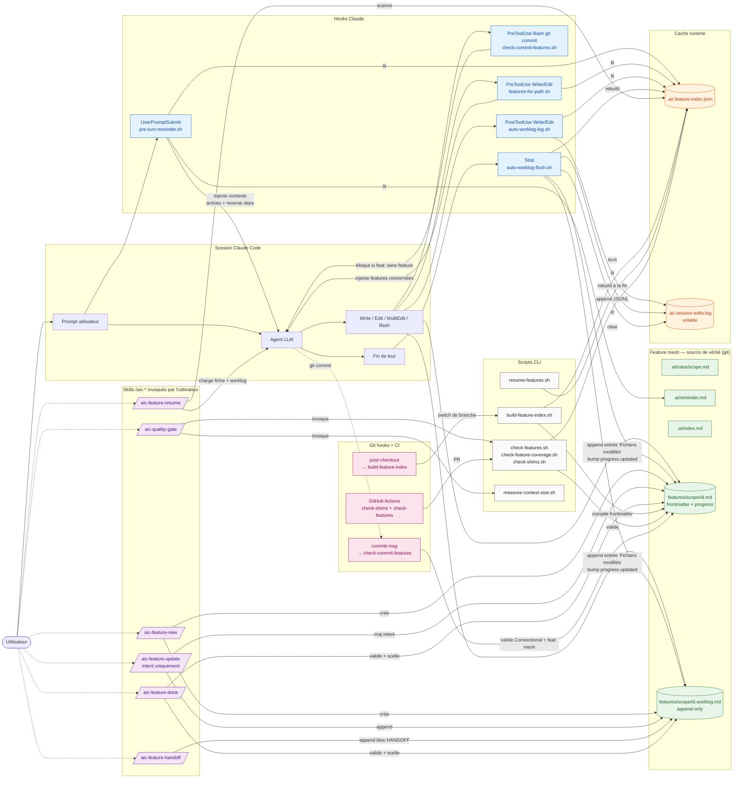

# ai_context

Template [copier](https://copier.readthedocs.io/) pour industrialiser le setup AI context dans n'importe quel projet : shims multi-agents, hooks runtime, feature mesh documenté, garde-fous CI, skills Claude `/aic-*` pour encadrer les gestes récurrents.

> **Objectif** : qu'un agent IA (Claude, Codex, Gemini, Copilot, Cursor) reprenne un projet mature avec **zéro ambiguïté** sur : ce qu'on attend de lui (rules), où sont les features (mesh), ce qui est en cours (progress), et comment clôturer proprement (quality gate).

---

## Sommaire

- [Pourquoi](#pourquoi)
- [Architecture](#architecture)
- [Installation](#installation)
- [Cas d'usage](#cas-dusage)
  - [1. Scaffolder un nouveau projet](#1-scaffolder-un-nouveau-projet)
  - [2. Migrer un projet existant](#2-migrer-un-projet-existant)
  - [3. Mettre à jour vers une nouvelle version du template](#3-mettre-à-jour-vers-une-nouvelle-version-du-template)
  - [4. Créer une nouvelle feature](#4-créer-une-nouvelle-feature)
  - [5. Reprendre un travail entre sessions](#5-reprendre-un-travail-entre-sessions)
  - [6. Passer la main à un autre scope (handoff)](#6-passer-la-main-à-un-autre-scope-handoff)
  - [7. Clôturer une feature](#7-clôturer-une-feature)
  - [8. Mesurer et optimiser le coût tokens](#8-mesurer-et-optimiser-le-coût-tokens)
  - [9. Détecter le code orphelin](#9-détecter-le-code-orphelin)
- [Profils de scope](#profils-de-scope)
- [Ce qui est généré](#ce-qui-est-généré)
- [Skills `/aic-*`](#skills-aic-)
- [Scripts runtime](#scripts-runtime)
- [Variables d'environnement](#variables-denvironnement)
- [FAQ](#faq)
- [Contribuer](#contribuer)

---

## Pourquoi

Chaque nouveau projet nécessite aujourd'hui un setup manuel (shims `CLAUDE.md`/`AGENTS.md`, hooks Claude, reminder runtime, scripts de garde-fou, organisation de la doc métier). Lent, oublis fréquents, écarts entre projets, agents qui divaguent parce qu'ils n'ont pas de repères stables.

Ce template **industrialise** tout ça :

| Problème récurrent | Solution apportée |
|---|---|
| Chaque agent (Claude/Codex/Gemini/Copilot/Cursor) cherche ses règles ailleurs | **Shims** pointant vers une source unique `.ai/index.md` |
| Règles métier noyées dans un CLAUDE.md géant | **`.ai/rules/<scope>.md`** chargés à la demande |
| Agent qui invente des features ou duplique du code | **Feature mesh** (`{{ docs_root }}/features/<scope>/<id>.md`) avec `touches:` vérifié |
| Pas de traçabilité entre commits et features | **Conventional Commits** bloquants, hook `feat:` refuse si aucune feature touchée |
| Travail perdu entre sessions | **Frontmatter `progress:`** + **worklog append-only** + `/aic-feature-resume` |
| Contexte qui explose les tokens | Filtrage par status + **`measure-context-size.sh`** + reminder compressé |
| Code orphelin (pas couvert par feature) | **`check-feature-coverage.sh`** détecte la dérive |
| Index stale après switch de branche | Hook git **`post-checkout`** rebuild auto |

---

## Architecture

Trois plans superposés : (1) **source de vérité** = feature mesh en markdown versionné, (2) **cache** = index JSON reconstruit à la demande, (3) **runtime** = hooks Claude + git qui lisent/écrivent ces deux-là pour guider l'agent sans intervention manuelle.

### Vue d'ensemble



### Lecture rapide

- **Vert** = source de vérité (versionnée). Jamais touchée en dehors d'une action explicite.
- **Orange** = cache (gitignored). Reconstruit déterministiquement à partir du vert ; jetable.
- **Bleu** = hooks Claude (automatiques, invisibles, silencieux).
- **Violet** = skills `/aic-*` (invoqués par l'utilisateur, gestes récurrents).
- **Gris** = scripts CLI (réutilisés par hooks, skills, CI).
- **Rose** = garde-fous git/CI (bloquants sur intégration).

### Cycle de vie d'un tour Claude

1. **UserPromptSubmit** → `pre-turn-reminder.sh` injecte `reminder.md` + features actives filtrées par `status` + reverse deps.
2. **Agent** raisonne et décide d'écrire.
3. **PreToolUse Write/Edit** → `features-for-path.sh` injecte en additional context les features qui couvrent le path modifié (via `touches:`).
4. **PreToolUse Bash git commit** → `check-commit-features.sh` valide Conventional Commits et bloque `feat:` si aucune feature touchée.
5. **PostToolUse Write/Edit** → `auto-worklog-log.sh` append au log volatile.
6. **Stop** (fin de tour) → `auto-worklog-flush.sh` flush le log dans les worklogs des features impactées, bumpe `progress.updated`, rebuild l'index, clear le log.

Aucune de ces étapes ne demande d'action de l'utilisateur. Les skills `/aic-*` servent aux gestes qui requièrent une **décision** : créer, reprendre, changer d'intent, passer la main, clôturer.

## Installation

```bash
pip install --user copier      # ou : brew install copier / pipx install copier
copier --version               # ≥ 9.x attendu

# Prérequis runtime (installés dans le projet cible) :
brew install jq yq             # jq obligatoire ; yq v4 recommandé
# Linux : apt install jq + yq depuis https://github.com/mikefarah/yq
```

---

## Cas d'usage

### 1. Scaffolder un nouveau projet

```bash
copier copy gh:qhuy/ai_context ./mon-nouveau-projet
```

Copier pose 6 questions (nom, profil de scopes, langue commits, docs root, agents activés, CI). Puis :

```bash
cd mon-nouveau-projet
git init && git add -A && git commit -m "chore: scaffold ai_context"
git config core.hooksPath .githooks && chmod +x .githooks/*

bash .ai/scripts/check-shims.sh        # ✅ shims OK
bash .ai/scripts/check-features.sh     # ⚠️ aucune feature (normal au début)
```

Dans Claude Code : `/hooks` → activer les entrées listées dans `.claude/settings.json`.

### 2. Migrer un projet existant

Projet mature avec code + doc déjà en place. Voir [MIGRATION.md](MIGRATION.md) pour le guide complet. Résumé :

```bash
# 1. Preview dans un dossier jetable
copier copy --trust gh:qhuy/ai_context /tmp/preview
diff -r /tmp/preview . | less

# 2. Scaffold en place (copier demande skip/overwrite par fichier)
cd mon-projet-existant
copier copy --trust gh:qhuy/ai_context .

# 3. Bootstrap du feature mesh (big bang OU rolling — voir MIGRATION.md)

# 4. Activation progressive des hooks (git → Claude → CI)
```

### 3. Mettre à jour vers une nouvelle version du template

```bash
cd mon-projet
copier update
```

Les réponses précédentes sont relues depuis `.copier-answers.yml`. Un diff est proposé par fichier — tu contrôles ce qui est appliqué. Relis [CHANGELOG.md](CHANGELOG.md) pour les breaking notes éventuelles.

### 4. Créer une nouvelle feature

Dans Claude Code, invoque `/aic-feature-new` (le skill fait le reste). Ou manuellement, dans le dossier choisi via `docs_root` (`.docs` par défaut, `docs` possible) :

```bash
cp {{ docs_root }}/FEATURE_TEMPLATE.md {{ docs_root }}/features/back/auth-session.md
# Éditer id, scope, title, status, depends_on, touches
bash .ai/scripts/build-feature-index.sh --write
bash .ai/scripts/check-features.sh
```

Exemple de frontmatter rempli :

```yaml
---
id: auth-session
scope: back
title: Session JWT + refresh token
status: active
depends_on:
  - back/user-model
touches:
  - src/auth/**
  - src/middleware/auth.ts
progress:
  phase: implement
  step: "3/5 service layer"
  blockers: []
  resume_hint: "reprendre sur src/auth/service.ts — tests unitaires manquants"
  updated: 2026-04-23
---
```

### 5. Reprendre un travail entre sessions

**Le cas d'usage le plus précieux du template**. Au début d'une nouvelle session Claude :

```
/aic-feature-resume
```

Le skill exécute `resume-features.sh`, affiche :

```
═══ resume-features ═══

▶ EN COURS
  back/auth-session   phase=implement  step="3/5 service layer"  updated=2026-04-23
      ↳ reprendre sur src/auth/service.ts — tests unitaires manquants

⛔ BLOQUÉES
  front/checkout      phase=spec  blockers=API spec TBD côté partenaire

⏳ STALE (>14j sans update)
  back/billing-legacy phase=review  updated=2026-04-01
```

Tu choisis laquelle reprendre. Claude charge la fiche + le worklog + les rules du scope, résume l'état, demande confirmation, puis reprend au bon endroit.

**Auto-logging** (v0.7.1+) : deux hooks silencieux s'occupent du routine :
- `PostToolUse` sur Write/Edit/MultiEdit → logue chaque modification dans `.ai/.session-edits.log`
- `Stop` (fin de tour) → flush le log : une entrée worklog par feature touchée + bump `progress.updated` à today

Tu n'as donc **plus besoin** d'invoquer `/aic-feature-update` pour chaque "j'ai modifié tel fichier". Invoque-le uniquement pour les **changements d'intent** : nouvelle `phase`, apparition/levée de `blocker`, nouveau `resume_hint`.

### 6. Passer la main à un autre scope (handoff)

Tu finis la partie back d'une feature, le front doit prendre le relais (ou tu bascules de session demain). `/aic-feature-handoff` formalise :

```markdown
## 2026-04-23 14:30 — HANDOFF → front

### What delivered
- POST /api/sessions → 201 + refresh_token httpOnly
- Tests unit + integration verts

### What next needs
- Hook `useSession()` côté front
- Gestion du refresh silent avant expiration

### Blockers
aucun

### Status
PENDING
```

### 7. Clôturer une feature

`/aic-quality-gate` puis `/aic-feature-done` :

```
| Check                    | Status | Détails              |
|--------------------------|--------|----------------------|
| check-shims              | ✅      | 4/4                  |
| check-features           | ✅      | 12/12                |
| check-feature-coverage   | ⚠️      | 3 orphelins          |
| measure-context-size     | ℹ️      | 1820 chars (~455 tk) |
| feature.progress         | ✅      | phase=review         |

Verdict : GO
```

Puis `/aic-feature-done` valide l'evidence (build+tests), passe `status: done`, scelle le worklog, suggère :

```
feat(back): session JWT + refresh token
```

### 8. Mesurer et optimiser le coût tokens

Le template injecte du contexte à chaque tour (reminder + features actives + reverse deps). Sur un projet mature, ça peut gonfler. Mesure :

```bash
bash .ai/scripts/measure-context-size.sh
```

Sortie typique :
```
[UserPromptSubmit → pre-turn-reminder.sh]
  total          chars=1256   tokens~=(314..418)
    static       chars=401    tokens~=(100..133)
    inventory    chars=650    tokens~=(162..216)
    reverse_deps chars=205    tokens~=(51..68)
```

Leviers d'optimisation :
- Passer les features stables en `status: done` → masquées par défaut (filtre v0.6)
- Override ponctuel : `AI_CONTEXT_SHOW_ALL_STATUS=1` quand besoin de l'historique complet
- Warning auto si une feature a >20 dépendants (signal de découpage)

### 9. Détecter le code orphelin

```bash
bash .ai/scripts/check-feature-coverage.sh           # warn (défaut)
bash .ai/scripts/check-feature-coverage.sh --strict  # exit 1 si orphelins (CI)
```

Scanne `src/`, `app/`, `lib/` et liste les fichiers non couverts par un `touches:` de feature. À passer en `--strict` en CI quand la couverture est raisonnable (>80%).

---

## Profils de scope

| Profil | Scopes générés |
|---|---|
| `minimal` | core, quality, workflow |
| `backend` | core, quality, workflow, back, architecture, security, handoff |
| `fullstack` | backend + front |
| `custom` | minimal (tu ajoutes tes scopes à la main) |

---

## Ce qui est généré

```
mon-projet/
├── CLAUDE.md                      # shim → .ai/index.md
├── AGENTS.md                      # idem (codex)
├── GEMINI.md                      # idem
├── .github/copilot-instructions.md
├── .ai/
│   ├── index.md                   # point d'entrée canonique
│   ├── reminder.md                # hard rules (compressé v0.6)
│   ├── quality/QUALITY_GATE.md    # DoD bloquant
│   ├── rules/<scope>.md           # règles par scope
│   ├── scripts/
│   │   ├── _lib.sh                # helpers partagés
│   │   ├── build-feature-index.sh # compile l'index JSON
│   │   ├── pre-turn-reminder.sh   # UserPromptSubmit hook
│   │   ├── features-for-path.sh   # PreToolUse Write/Edit hook
│   │   ├── auto-worklog-log.sh    # PostToolUse Write/Edit hook
│   │   ├── auto-worklog-flush.sh  # Stop hook : worklog + updated
│   │   ├── auto-progress.sh       # Stop/pre-commit : spec → implement
│   │   ├── check-shims.sh
│   │   ├── check-ai-references.sh
│   │   ├── check-features.sh
│   │   ├── check-commit-features.sh
│   │   ├── check-feature-coverage.sh
│   │   ├── resume-features.sh     # v0.7 — reprise entre sessions
│   │   └── measure-context-size.sh
│   └── .feature-index.json        # cache (gitignored)
├── .claude/
│   ├── settings.json              # hooks Claude Code
│   └── skills/aic-*/              # 6 skills /aic-* (v0.7)
├── .githooks/
│   ├── commit-msg                 # Conventional Commits + feat: mesh
│   ├── pre-commit                 # auto-progression agent-agnostic
│   └── post-checkout              # rebuild index après switch branche
├── .github/workflows/             # CI opt-in
└── {{ docs_root }}/
    ├── FEATURE_TEMPLATE.md
    └── features/<scope>/
        ├── <id>.md                # frontmatter + doc métier
        └── <id>.worklog.md        # append-only, progression
```

---

## Skills `/aic-*`

Six skills Claude Code, structure `SKILL.md` (frontmatter minimal) + `workflow.md` (phases détaillées) :

| Skill | Quand l'utiliser |
|---|---|
| `/aic-feature-new` | Avant tout `feat:` — crée fiche + worklog init |
| `/aic-feature-resume` | Début de session — scan des features en cours, choix, chargement contexte |
| `/aic-feature-update` | **Changement d'intent** uniquement (phase, blockers, resume_hint). Le log des fichiers modifiés est auto (hooks `PostToolUse` + `Stop`). |
| `/aic-feature-handoff` | Bascule de scope ou de session (bloc HANDOFF formalisé) |
| `/aic-quality-gate` | Avant commit `feat:` ou PR — verdict go/no-go factuel |
| `/aic-feature-done` | Clôture (evidence + status: done + commit suggéré) |

---

## Scripts runtime

| Script | Rôle |
|---|---|
| `_lib.sh` | Helpers partagés : dépendances, status visibles, matching canonique `touches:`, `docs_root` runtime |
| `build-feature-index.sh` | Compile `{{ docs_root }}/features/**/*.md` → `.ai/.feature-index.json` |
| `pre-turn-reminder.sh` | Hook `UserPromptSubmit` : reminder + inventory filtré + reverse deps |
| `features-for-path.sh` | Hook `PreToolUse Write` : features qui couvrent un path |
| `check-shims.sh` | Vérifie shims cohérents avec `.ai/index.md` |
| `check-ai-references.sh` | Détecte les références cassées vers `.ai/` |
| `check-features.sh` | Valide frontmatter + scope + `depends_on` + `touches` |
| `check-commit-features.sh` | Conventional Commits + `feat:` exige feature touchée |
| `check-feature-coverage.sh` | Détecte code orphelin (non couvert par `touches:`) |
| `resume-features.sh` | Buckets EN COURS / BLOQUÉES / STALE / À FAIRE |
| `measure-context-size.sh` | Mesure chars/tokens injectés par hook |
| `auto-worklog-log.sh` | Hook `PostToolUse` : logue les éditions dans `.session-edits.log` |
| `auto-worklog-flush.sh` | Hook `Stop` : flush log → worklog + bump `progress.updated` |

Tous les scripts runtime lisent le dossier métier via `AI_CONTEXT_DOCS_ROOT` rendu depuis `docs_root` (`.docs` par défaut). Les entrées `touches:` sont matchées par un helper unique (`path_matches_touch`) pour garder la même sémantique entre `features-for-path`, auto-worklog, coverage et `pre-commit`.

---

## Variables d'environnement

| Variable | Effet |
|---|---|
| `AI_CONTEXT_DEBUG=1` | Logs détaillés des hooks sur stderr |
| `AI_CONTEXT_SHOW_ALL_STATUS=1` | Inclut `done/deprecated/archived` dans le reminder (sinon filtré) |
| `AI_CONTEXT_FOCUS=<scope>` | Réduit l'inventaire au scope + ses voisins 1-hop (graph-aware). Équivalent : `pre-turn-reminder.sh --focus=<scope>`. Gain typique ~5× tokens sur mesh >100 features. |
| `AI_CONTEXT_DOCS_ROOT=<dir>` | Override runtime du dossier métier généré par `docs_root` (utile pour diagnostic/migration). |

---

## FAQ

**Q — Faut-il documenter 100% du code dans des features ?**
Non. Stratégie **rolling** possible : tu documentes au fil des modifs. `check-feature-coverage.sh --warn` te liste les orphelins. Passe en `--strict` seulement quand la couverture est raisonnable.

**Q — Comment rendre plusieurs features invisibles sans les supprimer ?**
Passe-les en `status: done` (ou `deprecated`, `archived`). Le filtre v0.6 les masque du reminder. Override ponctuel via `AI_CONTEXT_SHOW_ALL_STATUS=1`.

**Q — Que se passe-t-il si deux sessions travaillent sur la même feature ?**
Rien de bloquant côté template (pas de lock). Le worklog étant append-only, les deux entrées coexistent avec timestamps. Bonne pratique : `/aic-feature-handoff` dès qu'on anticipe un conflit.

**Q — Comment étendre le template pour mon domaine ?**
- Ajoute un scope : `.ai/rules/<mon-scope>.md` + `{{ docs_root }}/features/<mon-scope>/`.
- Ajoute un skill : `template/.claude/skills/aic-<verb>/SKILL.md.jinja + workflow.md.jinja`.
- Ajoute un check : script sous `.ai/scripts/` + appel dans `.github/workflows/`.

**Q — Le template supporte-t-il les monorepos ?**
Oui, via `docs_root: docs` et une convention de scopes par sous-projet (`back-api`, `back-worker`, `front-web`, etc.). Le mesh est indépendant de la structure du code, et les scripts runtime suivent ce `docs_root` généré.

**Q — Comment débugger un hook Claude qui semble muet ?**
`AI_CONTEXT_DEBUG=1 bash .ai/scripts/pre-turn-reminder.sh` pour voir les traces. Vérifie aussi `.claude/settings.json` via `/hooks` dans Claude Code.

---

## Contribuer

Template versionné. Non-cassant → bump minor. Refonte → bump major (les consommateurs résoudront le diff via `copier update`).

- [CHANGELOG.md](CHANGELOG.md) — toutes les versions
- [MIGRATION.md](MIGRATION.md) — adopter le template sur projet existant
- [docs/variables.md](docs/variables.md) — référence des questions copier
- [docs/getting-started.md](docs/getting-started.md) — tour complet
- [docs/upgrading.md](docs/upgrading.md) — updates

Tests : `bash tests/smoke-test.sh` (27 étapes, exige `copier` dans le PATH).

---

## Licence

MIT — voir [LICENSE](LICENSE).
