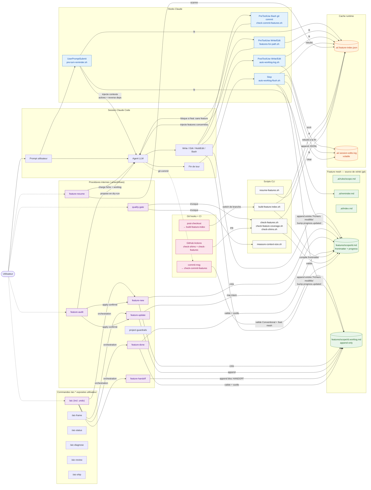

# ai_context

Template [copier](https://copier.readthedocs.io/) pour industrialiser le setup AI context dans n'importe quel projet : shims multi-agents, hooks runtime, feature mesh documenté, garde-fous CI, couche comportementale agent, skills Claude `/aic-*` pour encadrer les gestes récurrents.

> **Objectif** : qu'un agent IA reprenne un projet mature avec **zéro ambiguïté** sur : ce qu'on attend de lui (rules), où sont les features (mesh), ce qui est en cours (progress), et comment clôturer proprement (quality gate).
>
> **Honnêteté de scope** : le template est **Claude-first runtime, multi-agent shims**. Tous les agents (Claude, Codex, Gemini, Copilot, Cursor) lisent les mêmes rules statiques et passent les mêmes garde-fous git au commit. Mais l'**injection de contexte par tour** (reminder, features-for-path, auto-worklog, auto-progression immédiate) n'existe aujourd'hui que pour Claude Code. Les autres agents bénéficient des shims + git hooks. Voir [Capacités runtime par agent](#capacités-runtime-par-agent).

---

## Sommaire

- [Pourquoi](#pourquoi)
- [Capacités runtime par agent](#capacités-runtime-par-agent)
- [Architecture](#architecture)
- [Installation](#installation)
- [Cas d'usage](#cas-dusage)
  - [1. Scaffolder un nouveau projet](#1-scaffolder-un-nouveau-projet)
  - [2. Migrer un projet existant](#2-migrer-un-projet-existant)
  - [3. Mettre à jour vers une nouvelle version du template](#3-mettre-à-jour-vers-une-nouvelle-version-du-template)
  - [4. Créer une nouvelle feature](#4-créer-une-nouvelle-feature)
  - [5. Reprendre un travail entre sessions](#5-reprendre-un-travail-entre-sessions)
  - [6. Passer la main à un autre scope (handoff)](#6-passer-la-main-à-un-autre-scope-handoff)
  - [7. Clôturer une feature](#7-clôturer-une-feature)
  - [8. Mesurer et optimiser le coût tokens](#8-mesurer-et-optimiser-le-coût-tokens)
  - [9. Détecter le code orphelin](#9-détecter-le-code-orphelin)
- [Profils de scope](#profils-de-scope)
- [Profils techniques](#profils-techniques)
- [Ce qui est généré](#ce-qui-est-généré)
- [Couche agent behavior](#couche-agent-behavior)
- [Skills `/aic-*`](#skills-aic-)
- [Scripts runtime](#scripts-runtime)
- [Variables d'environnement](#variables-denvironnement)
- [FAQ](#faq)
- [Contribuer](#contribuer)

---

## Pourquoi

Chaque nouveau projet nécessite aujourd'hui un setup manuel (shims `CLAUDE.md`/`AGENTS.md`, hooks Claude, reminder runtime, scripts de garde-fou, organisation de la doc métier). Lent, oublis fréquents, écarts entre projets, agents qui divaguent parce qu'ils n'ont pas de repères stables.

Ce template **industrialise** tout ça :

| Problème récurrent | Solution apportée |
|---|---|
| Chaque agent (Claude/Codex/Gemini/Copilot/Cursor) cherche ses règles ailleurs | **Shims** pointant vers une source unique `.ai/index.md` |
| Règles métier noyées dans un CLAUDE.md géant | **`.ai/rules/<scope>.md`** chargés à la demande |
| Agent poli mais passif, vague ou trop explicatif | **`.ai/agent/*`** : posture, initiative, style de réponse et diagnostic juste-à-temps |
| Agent qui invente des features ou duplique du code | **Feature mesh** (`{{ docs_root }}/features/<scope>/<id>.md`) avec `touches:` vérifié |
| Pas de traçabilité entre commits et features | **Conventional Commits** bloquants, hook `feat:` refuse si aucune feature touchée |
| Travail perdu entre sessions | **Frontmatter `progress:`** + **worklog append-only** + `/aic-status` |
| Contexte qui explose les tokens | Filtrage par status + **`measure-context-size.sh`** + reminder compressé |
| Code orphelin (pas couvert par feature) | **`check-feature-coverage.sh`** détecte la dérive |
| Index stale après switch de branche | Hook git **`post-checkout`** rebuild auto |

---

## Capacités runtime par agent

| Capacité | Claude | Codex | Cursor | Gemini | Copilot |
|---|---|---|---|---|---|
| Shim racine + lecture `.ai/rules/*` | ✅ | ✅ | ✅ | ✅ | ✅ |
| Pre-turn reminder (UserPromptSubmit) | ✅ | ❌ | ❌ | ❌ | ❌ |
| Features-for-path injection (PreToolUse) | ✅ | ❌ | ⚠️ via MDC scopé | ❌ | ❌ |
| Auto-worklog log + flush (PostToolUse + Stop) | ✅ | ❌ | ❌ | ❌ | ❌ |
| Auto-progression immédiate (Stop hook) | ✅ | ❌ | ❌ | ❌ | ❌ |
| Skills `/aic-*` | ✅ | ❌ | ❌ | ❌ | ❌ |
| Conventional Commits + `feat:` mesh (commit-msg) | ✅ | ✅ | ✅ | ✅ | ✅ |
| Auto-progression au commit (pre-commit) | ✅ | ✅ | ✅ | ✅ | ✅ |
| Rebuild index post-checkout | ✅ | ✅ | ✅ | ✅ | ✅ |

Cursor : depuis la R3 du re-audit, le template scaffolde `.cursor/rules/<scope>.mdc` (back, front) avec frontmatter `globs:` qui auto-attache la règle aux fichiers du scope. C'est l'équivalent natif de `features-for-path.sh` côté Cursor — l'agent voit les rules du scope sans intervention quand il édite un fichier matché. Globs par défaut couvrent les conventions courantes ; à customiser dans le projet cible si la structure diffère.

Les agents non-Claude peuvent invoquer les scripts à la main quand utile (`bash .ai/scripts/features-for-path.sh <path>`, `bash .ai/scripts/resume-features.sh`). Des ports natifs (Cursor MDC, AGENTS.md enrichi) sont en réflexion — voir [PROJECT_STATE.md](PROJECT_STATE.md) roadmap.

## Architecture

Trois plans superposés : (1) **source de vérité** = feature mesh en markdown versionné, (2) **cache** = index JSON reconstruit à la demande, (3) **runtime** = hooks Claude + git qui lisent/écrivent ces deux-là pour guider l'agent sans intervention manuelle.

### Vue d'ensemble



### Lecture rapide

- **Vert** = source de vérité (versionnée). Jamais touchée en dehors d'une action explicite.
- **Orange** = cache (gitignored). Reconstruit déterministiquement à partir du vert ; jetable.
- **Bleu** = hooks Claude (automatiques, invisibles, silencieux).
- **Violet** = commandes/skills `/aic-*` (surface utilisateur + internes orchestrés par `/aic`).
- **Gris** = scripts CLI (réutilisés par hooks, skills, CI).
- **Rose** = garde-fous git/CI (bloquants sur intégration).

### Cycle de vie d'un tour Claude

1. **UserPromptSubmit** → `pre-turn-reminder.sh` injecte `reminder.md` + features actives filtrées par `status` + reverse deps.
2. **Agent** raisonne et décide d'écrire.
3. **PreToolUse Write/Edit** → `features-for-path.sh` injecte en additional context les features qui couvrent le path modifié (via `touches:`) + des extraits bornés de leurs fiches et `depends_on`.
4. **PreToolUse Bash git commit** → `check-commit-features.sh` valide Conventional Commits et bloque `feat:` si aucune feature touchée.
5. **PostToolUse Write/Edit** → `auto-worklog-log.sh` append au log volatile.
6. **Stop** (fin de tour) → `auto-worklog-flush.sh` flush le log dans les worklogs des features impactées, bumpe `progress.updated`, rebuild l'index, clear le log.

Aucune de ces étapes ne demande d'action de l'utilisateur. Les commandes exposées `/aic-*` servent aux gestes qui requièrent une **décision** ; les skills internes (`new/update/handoff/done`) restent orchestrés par `/aic` sauf fallback explicite.

## Installation

```bash
pip install --user copier      # ou : brew install copier / pipx install copier
copier --version               # ≥ 9.x attendu

# Prérequis runtime (installés dans le projet cible) :
brew install jq yq             # jq obligatoire ; yq v4 recommandé
# Linux : apt install jq + yq depuis https://github.com/mikefarah/yq
```

---

## Cas d'usage

### 1. Scaffolder un nouveau projet

```bash
copier copy gh:qhuy/ai_context ./mon-nouveau-projet
```

Copier pose les questions de base (nom, profil de scopes, preset technique optionnel, langue commits, docs root, agents activés, CI). Puis :

```bash
cd mon-nouveau-projet
git init && git add -A && git commit -m "chore: scaffold ai_context"
git config core.hooksPath .githooks && chmod +x .githooks/*

bash .ai/scripts/check-shims.sh        # ✅ shims OK
bash .ai/scripts/check-features.sh     # ⚠️ aucune feature (normal au début)
```

Puis (recommandé) cadrer la première vraie tâche avant d'implémenter — objectif, non-goals, spécificités métier/technique, plan et validation :

```
# Dans Claude Code :
/aic-frame
```

Si le cadrage révèle des non-goals ou un glossaire durable, l'agent peut proposer de créer `.ai/guardrails.md` (chargé via Pack A à chaque session, coût tokens nul à chaque tour).

Exemple pour un projet C# backend + React/Next :

```bash
copier copy gh:qhuy/ai_context ./mon-projet \
  --data scope_profile=fullstack \
  --data tech_profile=fullstack-dotnet-react
```

Dans Claude Code : `/hooks` → activer les entrées listées dans `.claude/settings.json`.

### 2. Migrer un projet existant

Projet mature avec code + doc déjà en place. Voir [MIGRATION.md](MIGRATION.md) pour le guide complet.

Ne lance pas `copier copy ... .` à l'aveugle si le projet contient déjà `AGENTS.md`, `.ai/`, `.docs/`, `.claude/`, `.github/` ou des hooks. Le bon réflexe est une migration en preview puis copie sélective.

```bash
# 1. Vérifier que le repo cible est propre
cd mon-projet-existant
git status

# 2. Créer une branche de migration
git checkout -b codex/install-ai-context-template

# 3. Générer le template hors projet
rm -rf /tmp/ai-context-preview
copier copy --trust gh:qhuy/ai_context /tmp/ai-context-preview \
  --data project_name=mon-projet \
  --data scope_profile=backend \
  --data tech_profile=dotnet-clean-cqrs \
  --data docs_root=.docs

# 4. Comparer avant toute copie
diff -qr /tmp/ai-context-preview . | less
```

#### Cas fréquent : projet déjà équipé d'un contexte AI

Si le projet a déjà `.ai/index.md`, `.ai/rules/*.md`, `.docs/features/*.md`, des shims racine ou une config Claude, ne remplace pas ces fichiers en bloc. Ils contiennent probablement des règles métier et de la mémoire projet à conserver.

À copier depuis la preview en priorité :

```text
.ai/quality/QUALITY_GATE.md
.ai/scripts/_lib.sh
.ai/scripts/build-feature-index.sh
.ai/scripts/check-ai-references.sh
.ai/scripts/check-commit-features.sh
.ai/scripts/check-feature-coverage.sh
.ai/scripts/features-for-path.sh
.ai/scripts/resume-features.sh
.ai/scripts/measure-context-size.sh
.ai/scripts/auto-worklog-log.sh
.ai/scripts/auto-worklog-flush.sh
.ai/scripts/auto-progress.sh
.ai/rules/tech-dotnet.md              # si tech_profile=dotnet-clean-cqrs
.ai/rules/tech-react.md               # si tech_profile=react-next
.ai/rules/stack-fullstack-dotnet-react.md
.githooks/
.docs/FEATURE_TEMPLATE.md
README_AI_CONTEXT.md
```

À fusionner manuellement, pas écraser :

```text
.ai/index.md
.ai/rules/back.md
.ai/rules/front.md
.ai/rules/architecture.md
.ai/rules/security.md
.ai/rules/workflow.md
.ai/rules/quality.md
.claude/settings.json
AGENTS.md
CLAUDE.md
GEMINI.md
.github/copilot-instructions.md
.github/workflows/*
.docs/features/*
```

#### Migration progressive du feature mesh

Beaucoup de projets existants ont déjà une documentation feature à plat :

```text
.docs/features/tenant_lifecycle.md
.docs/features/ticket_dispatch.md
```

Le template attend un mesh scopé :

```text
.docs/features/back/tenant_lifecycle.md
.docs/features/back/ticket_dispatch.md
```

Tu peux migrer progressivement. Commence par quelques features pilotes avec un frontmatter minimal :

```yaml
---
id: tenant_lifecycle
scope: back
title: Tenant Lifecycle
status: active
depends_on: []
touches:
  - src/MonProjet.Tenants/**
---
```

Puis active les checks en douceur :

```bash
git config core.hooksPath .githooks
chmod +x .githooks/*

bash .ai/scripts/check-shims.sh
bash .ai/scripts/check-ai-references.sh
bash .ai/scripts/check-features.sh
```

Stratégie recommandée en deux commits :

1. `chore(ai): installer le runtime ai_context` — scripts, hooks, quality gate, presets techniques, README AI.
2. `docs(ai): migrer les premières features vers le mesh` — quelques fiches `.docs/features/<scope>/*.md` avec `touches:`.

Quand le mesh couvre suffisamment le projet, tu peux rendre `check-features.sh` et `check-feature-coverage.sh --strict` bloquants en CI.

### 3. Mettre à jour vers une nouvelle version du template

```bash
cd mon-projet
copier update
```

Les réponses précédentes sont relues depuis `.copier-answers.yml`. Un diff est proposé par fichier — tu contrôles ce qui est appliqué. Relis [CHANGELOG.md](CHANGELOG.md) pour les breaking notes éventuelles.

### 4. Cadrer puis créer une nouvelle feature

Dans Claude Code, commence par `/aic-frame`. Il produit un cadrage stable : objectif, position recommandée, spécificités métier, spécificités techniques, plan, validation et points à confirmer. Si la feature est claire, il propose ensuite `scope/id`, `depends_on` et `touches`, puis demande confirmation avant de créer la fiche.

Fallback manuel, dans le dossier choisi via `docs_root` (`.docs` par défaut, `docs` possible) :

```bash
cp {{ docs_root }}/FEATURE_TEMPLATE.md {{ docs_root }}/features/back/auth-session.md
# Éditer id, scope, title, status, depends_on, touches
bash .ai/scripts/build-feature-index.sh --write
bash .ai/scripts/check-features.sh
```

Exemple de frontmatter rempli :

```yaml
---
id: auth-session
scope: back
title: Session JWT + refresh token
status: active
depends_on:
  - back/user-model
touches:
  - src/auth/**
  - src/middleware/auth.ts
progress:
  phase: implement
  step: "3/5 service layer"
  blockers: []
  resume_hint: "reprendre sur src/auth/service.ts — tests unitaires manquants"
  updated: 2026-04-23
---
```

### 5. Reprendre un travail entre sessions

**Le cas d'usage le plus précieux du template**. Au début d'une nouvelle session Claude :

```
/aic-status
```

Le skill exécute `resume-features.sh` et, si un delta git existe, `review-delta.sh`. Il affiche un état actionnable :

```
═══ resume-features ═══

▶ EN COURS
  back/auth-session   phase=implement  step="3/5 service layer"  updated=2026-04-23
      ↳ reprendre sur src/auth/service.ts — tests unitaires manquants

⛔ BLOQUÉES
  front/checkout      phase=spec  blockers=API spec TBD côté partenaire

⏳ STALE (>14j sans update)
  back/billing-legacy phase=review  updated=2026-04-01
```

Tu choisis laquelle reprendre. Claude charge la fiche + le worklog + les rules du scope, résume l'état, demande confirmation, puis reprend au bon endroit. La logique de reprise vit dans `.ai/workflows/feature-resume.md`, utilisable aussi par Codex ; `/aic-status` est l'entrée recommandée côté Claude.

**Auto-logging** (v0.7.1+) : deux hooks silencieux s'occupent du routine :
- `PostToolUse` sur Write/Edit/MultiEdit → logue chaque modification dans `.ai/.session-edits.log`
- `Stop` (fin de tour) → flush le log : une entrée worklog par feature touchée + bump `progress.updated` à today

Tu n'as donc **plus besoin** de demander une mise à jour procédurale pour chaque "j'ai modifié tel fichier". Passe par `/aic` pour les rares corrections d'intent : nouvelle `phase`, apparition/levée de `blocker`, nouveau `resume_hint`.

### 6. Passer la main à un autre scope (handoff)

Tu finis la partie back d'une feature, le front doit prendre le relais (ou tu bascules de session demain). Demande-le en langage naturel ou via `/aic` ; la procédure interne `.ai/workflows/feature-handoff.md` formalise :

```markdown
## 2026-04-23 14:30 — HANDOFF → front

### What delivered
- POST /api/sessions → 201 + refresh_token httpOnly
- Tests unit + integration verts

### What next needs
- Hook `useSession()` côté front
- Gestion du refresh silent avant expiration

### Blockers
aucun

### Status
PENDING
```

### 7. Clôturer une feature

Utilise `/aic-ship` :

```
| Check                    | Status | Détails              |
|--------------------------|--------|----------------------|
| check-shims              | ✅      | 4/4                  |
| check-features           | ✅      | 12/12                |
| check-feature-coverage   | ⚠️      | 3 orphelins          |
| measure-context-size     | ℹ️      | 1820 chars (~455 tk) |
| feature.progress         | ✅      | phase=review         |

Verdict : GO
```

Si le verdict est `GO`, `/aic-ship` propose un message de commit en français et attend confirmation avant toute action git. La clôture technique s'appuie sur `.ai/workflows/quality-gate.md` et `.ai/workflows/feature-done.md` quand nécessaire.

```
feat(back): session JWT + refresh token
```

### 8. Mesurer et optimiser le coût tokens

Le template injecte du contexte à chaque tour (reminder + features actives + reverse deps). Sur un projet mature, ça peut gonfler. Mesure :

```bash
bash .ai/scripts/measure-context-size.sh
```

Sortie typique :
```
[UserPromptSubmit → pre-turn-reminder.sh]
  total          chars=1256   tokens~=(314..418)
    static       chars=401    tokens~=(100..133)
    inventory    chars=650    tokens~=(162..216)
    reverse_deps chars=205    tokens~=(51..68)
```

Leviers d'optimisation :
- Passer les features stables en `status: done` → masquées par défaut (filtre v0.6)
- Override ponctuel : `AI_CONTEXT_SHOW_ALL_STATUS=1` quand besoin de l'historique complet
- Warning auto si une feature a >20 dépendants (signal de découpage)

### 9. Détecter le code orphelin

```bash
bash .ai/scripts/check-feature-coverage.sh           # warn (défaut)
bash .ai/scripts/check-feature-coverage.sh --strict  # exit 1 si orphelins (CI)
```

Scanne `src/`, `app/`, `lib/` et liste les fichiers non couverts par un `touches:` de feature. À passer en `--strict` en CI quand la couverture est raisonnable (>80%).

Côté Claude, demande une review du mesh via `/aic-review`. En maintenance avancée, la procédure `.ai/workflows/feature-audit.md` couvre les modes `discover <scope>` et `refresh <scope>/<id>` pour proposer un `id`/`title` par groupe d'orphelins ou re-synchroniser le frontmatter (`touches`, `depends_on`, `status`) avec la réalité du code.

---

## Profils de scope

| Profil | Scopes générés |
|---|---|
| `minimal` | core, quality, workflow |
| `backend` | core, quality, workflow, back, architecture, security, handoff |
| `fullstack` | backend + front |
| `custom` | minimal (tu ajoutes tes scopes à la main) |

## Profils techniques

`tech_profile` ajoute des règles de stack sans changer le feature mesh. Le profil `generic` reste le défaut.

| Profil | Règles générées |
|---|---|
| `generic` | aucune règle stack spécifique |
| `dotnet-clean-cqrs` | `.ai/rules/tech-dotnet.md` |
| `react-next` | `.ai/rules/tech-react.md` |
| `fullstack-dotnet-react` | règles .NET + React + contrat back/front |

Ces presets sont volontairement courts : ils orientent l'agent sur architecture, contrats, validation et garde-fous sécurité, puis laissent le projet cible préciser ses conventions locales.

## Modes d'adoption

`adoption_mode` ajuste le niveau d'enforcement sans changer le cœur des scripts.

| Mode | Effet exact |
|---|---|
| `lite` | retire `.githooks` (git hooks) **et** `.github/workflows/` (CI). Les hooks Claude (`.claude/settings.json`) restent générés si `claude` est dans `agents` — ils sont **disponibles mais optionnels** : à activer via `/hooks` si tu veux l'injection runtime côté Claude. |
| `standard` | expérience complète : git hooks + CI (si `enable_ci_guard=true`) + hooks Claude (si `claude` actif). |
| `strict` | comme `standard`, plus : (a) `.github/workflows/` conservé même si `enable_ci_guard=false`, (b) la CI exécute `doctor.sh --strict` (échec si dépendances/structure incomplètes), (c) la CI exécute `check-feature-coverage.sh --strict` (échec si code orphelin non couvert par `touches:`). À choisir uniquement quand le mesh couvre raisonnablement le projet (≥80%). |

> En `lite + claude`, les hooks Claude sont scaffoldés mais aucun n'est imposé : tu décides dans `/hooks` ce que tu actives. Pour les git hooks, `lite` ne les scaffolde pas du tout — passe en `standard`/`strict` ou copie `.githooks/` à la main si tu changes d'avis plus tard.

---

## Ce qui est généré

```
mon-projet/
├── CLAUDE.md                      # shim → .ai/index.md
├── AGENTS.md                      # idem (codex)
├── GEMINI.md                      # idem
├── .github/copilot-instructions.md
├── .ai/
│   ├── index.md                   # point d'entrée canonique
│   ├── reminder.md                # hard rules (compressé v0.6)
│   ├── config.yml                 # config runtime optionnelle (coverage/progress/context)
│   ├── agent/
│   │   ├── posture.md             # posture, écoute, diagnostic, prise de position
│   │   ├── initiative-contract.md # agir / proposer / demander confirmation
│   │   └── response-style.md      # réponses concrètes + prochaine action
│   ├── schema/
│   │   └── feature.schema.json    # contrat frontmatter (status, progress.phase, etc.)
│   ├── quality/QUALITY_GATE.md    # DoD bloquant
│   ├── rules/<scope>.md           # règles par scope
│   ├── rules/tech-*.md            # règles stack optionnelles
│   ├── scripts/
│   │   ├── _lib.sh                # helpers partagés
│   │   ├── build-feature-index.sh # compile l'index JSON
│   │   ├── pre-turn-reminder.sh   # UserPromptSubmit hook
│   │   ├── features-for-path.sh   # PreToolUse Write/Edit hook
│   │   ├── auto-worklog-log.sh    # PostToolUse Write/Edit hook
│   │   ├── auto-worklog-flush.sh  # Stop hook : worklog + updated
│   │   ├── auto-progress.sh       # Stop/pre-commit : spec → implement
│   │   ├── check-shims.sh
│   │   ├── check-ai-references.sh
│   │   ├── check-features.sh
│   │   ├── check-commit-features.sh
│   │   ├── check-feature-coverage.sh
│   │   ├── resume-features.sh     # v0.7 — reprise entre sessions
│   │   ├── audit-features.sh      # audit agent-agnostique (discover, dry-run)
│   │   ├── migrate-features.sh    # migration frontmatter (dry-run/apply)
│   │   ├── pr-report.sh           # rapport markdown depuis un diff git
│   │   ├── doctor.sh              # diagnostic installation (non destructif)
│   │   └── measure-context-size.sh
│   └── .feature-index.json        # cache (gitignored)
├── .claude/
│   ├── settings.json              # hooks Claude Code
│   └── skills/aic-*/              # skills Claude /aic-* (dont /aic-diagnose)
├── .githooks/
│   ├── commit-msg                 # Conventional Commits + feat: mesh
│   ├── pre-commit                 # auto-progression agent-agnostic
│   └── post-checkout              # rebuild index après switch branche
├── .github/workflows/             # CI opt-in
└── {{ docs_root }}/
    ├── FEATURE_TEMPLATE.md
    └── features/<scope>/
        ├── <id>.md                # frontmatter + doc métier
        └── <id>.worklog.md        # append-only, progression
```

---

## Couche agent behavior

La couche `.ai/agent/*` ajoute de la qualité comportementale sans grossir les shims ni le reminder :

- `posture.md` : écoute, diagnostic, prise de position, rigueur sans sur-explication.
- `initiative-contract.md` : quand agir directement, quand proposer, quand demander confirmation.
- `response-style.md` : réponses concrètes, persuasion non manipulatrice, récap de clôture adaptatif, recommandation et prochaine action.

Chargement : `.ai/index.md` la référence dans le Pack A, à lire une fois en début de session ou pour une tâche importante. Elle n'est pas injectée à chaque tour par `pre-turn-reminder.sh`, donc son coût est visible seulement quand l'agent la charge explicitement.

Clôture attendue : l'agent termine les tâches significatives par un récap lisible, adapté à la taille du travail. Pour une petite tâche, le format compact suffit :

```markdown
Fait : <résultat observable>
Vérifié : <check lancé, ou non lancé avec raison>
Recommandation : <position assumée>
Prochaine action : <action minimale utile>
```

Pour une tâche plus large, une review ou une décision, le format structuré ajoute un tableau `Résultat / Périmètre / Vérifications / Risques restants`, puis une recommandation et une prochaine action. Le tableau n'est pas obligatoire : il est utilisé seulement quand il améliore la lecture.

Compatibilité :

- **Claude Code** peut utiliser `/aic-diagnose` pour produire un diagnostic stable.
- **Codex** n'a pas besoin de skill Claude : il lit `AGENTS.md` → `.ai/index.md`, charge `.ai/agent/*`, puis applique le même contrat en langage naturel. Demande type : "diagnostique le blocage".

Format attendu du diagnostic :

```markdown
## Diagnostic

Bottleneck principal :
<spec / contexte / scope / architecture / implémentation / tests / doc / qualité / décision produit>

Pourquoi :
- ...

Ce que je recommande :
1. ...

Ce que je ne recommande pas :
- ...

Prochaine action minimale :
- ...
```

---

## Skills `/aic-*`

Le template embarque des skills Claude Code (`SKILL.md` + `workflow.md`) et distingue clairement surface utilisateur vs mécanismes internes. Les agents non-Claude consomment les mêmes contrats via `.ai/index.md`, `.ai/agent/*`, les scripts et le feature mesh.

### Exposés utilisateur (usage direct)

| Commande | Quand l'utiliser |
|---|---|
| `/aic` | Override conversationnel (inclut `/aic undo`) si l'auto-progression se trompe |
| `/aic-frame` | Cadrage avant implémentation — objectif, position, spécificités métier/technique, plan, validation |
| `/aic-status` | Début de session — état actionnable, blockers, stale, delta courant, prochaine reprise |
| `/aic-diagnose` | Diagnostic du bottleneck principal. Équivalent Codex : "diagnostique le blocage" |
| `/aic-review` | Avant review/PR — risques du delta, features impactées, doc/freshness, checks |
| `/aic-ship` | Avant commit/push — quality gate, evidence, commit proposé, confirmation obligatoire |

### Procédures internes agent-agnostic

| Procédure | Rôle |
|---|---|
| `.ai/workflows/feature-new.md` | Créer fiche + worklog initial |
| `.ai/workflows/feature-resume.md` | Reprise déterministe, backend de `/aic-status` |
| `.ai/workflows/feature-update.md` | Mettre à jour `progress.*` sur changement d'intent |
| `.ai/workflows/feature-handoff.md` | Formaliser une passation inter-scope/session |
| `.ai/workflows/feature-audit.md` | Rétro-doc/re-sync, maintenance mesh |
| `.ai/workflows/quality-gate.md` | Backend déterministe de `/aic-ship` |
| `.ai/workflows/project-guardrails.md` | Procédure de cadrage guardrails, déclenchée via `/aic-frame` |
| `.ai/workflows/feature-done.md` | Clôturer la feature (evidence + status `done`) |

---

## Scripts runtime

| Script | Rôle |
|---|---|
| `_lib.sh` | Helpers partagés : dépendances, status visibles, matching canonique `touches:` / `touches_shared:`, `docs_root` runtime |
| `build-feature-index.sh` | Compile `{{ docs_root }}/features/**/*.md` → `.ai/.feature-index.json` |
| `pre-turn-reminder.sh` | Hook `UserPromptSubmit` : reminder + inventory filtré + reverse deps |
| `features-for-path.sh` | Hook `PreToolUse Write` : features qui couvrent un path + contexte feature borné ; CLI `--with-docs` pour Codex |
| `check-shims.sh` | Vérifie shims cohérents avec `.ai/index.md` |
| `check-ai-references.sh` | Détecte les références cassées vers `.ai/` |
| `check-features.sh` | Valide frontmatter + scope + `depends_on` + `touches` |
| `check-commit-features.sh` | Conventional Commits + `feat:` exige feature touchée |
| `check-feature-coverage.sh` | Détecte code orphelin (non couvert par `touches:`) |
| `resume-features.sh` | Buckets EN COURS / BLOQUÉES / STALE / À FAIRE |
| `audit-features.sh` | Audit agent-agnostique (`discover <scope>`, dry-run par défaut) |
| `migrate-features.sh` | Migration frontmatter (dry-run par défaut, `--apply` explicite) |
| `pr-report.sh` | Génère un rapport PR markdown/json (features impactées + liées + warnings) |
| `review-delta.sh` | Synthèse review-friendly du delta courant (fichiers, features, risques, checks) |
| `doctor.sh` | Diagnostic installation (dépendances, hooks, checks) |
| `measure-context-size.sh` | Mesure chars/tokens injectés par hook |
| `auto-worklog-log.sh` | Hook `PostToolUse` : logue les éditions dans `.session-edits.log` |
| `auto-worklog-flush.sh` | Hook `Stop` : flush log → worklog + bump `progress.updated` |
| `aic-undo.sh` | Annule la dernière transition auto-progressée (lit `.progress-history.jsonl`, restaure le frontmatter, append au worklog, rebuild index). Headless ; le skill `/aic undo` s'appuie dessus. `--dry-run` par défaut, `--apply` pour exécuter. |
| `ai-context.sh` | CLI UX : `mission "<objectif>"`, `status`, `brief <path>`, `document-delta`, `repair`, `ship-report`, puis routes `doctor` / `resume` / `audit` / `migrate` / `pr-report` / `review` / `measure` / `check` / `coverage` / `shims` / `index` / `reminder`. |

Tous les scripts runtime lisent le dossier métier via `AI_CONTEXT_DOCS_ROOT` rendu depuis `docs_root` (`.docs` par défaut). Les entrées `touches:` sont matchées par un helper unique (`path_matches_touch`) pour garder la même sémantique entre `features-for-path`, auto-worklog, coverage et `pre-commit`. `touches_shared:` sert aux surfaces transverses visibles en review mais non bloquantes pour `check-feature-freshness --staged`.

## Champs actifs de `.ai/config.yml`

`.ai/config.yml` est scaffoldé par défaut. Tous les champs sont prévus, mais tous ne sont pas encore consommés par les scripts. Référence à jour :

| Champ | Statut runtime | Lu par |
|---|---|---|
| `project_id` | ✅ actif | `build-feature-index.sh` (émis dans `.ai/.feature-index.json`) |
| `coverage.roots` | ✅ actif | `check-feature-coverage.sh` |
| `coverage.extensions` | ✅ actif | `check-feature-coverage.sh` |
| `coverage.exclude_dirs` | ✅ actif | `check-feature-coverage.sh` |
| `progress.stale_after_days` | ✅ actif | `resume-features.sh` |
| `progress.auto_transitions.spec_to_implement` | ✅ actif | `auto-progress.sh` (opt-out : passer à `false` désactive l'auto spec→implement) |
| `progress.history_max_entries` | ✅ actif | `auto-progress.sh` (FIFO snapshots `/aic undo`, défaut 50) |
| `context.show_statuses` | 🚧 prévu | non lu aujourd'hui — `pre-turn-reminder.sh` filtre via `AI_CONTEXT_SHOW_ALL_STATUS` |
| `context.default_focus` | 🚧 prévu | non lu aujourd'hui — `pre-turn-reminder.sh` lit `AI_CONTEXT_FOCUS` |
| `context.max_tokens_warn` | ✅ actif | `pre-turn-reminder.sh` (warning stderr si le contexte injecté dépasse le seuil ; 0 = désactivé) |
| `docs_root` | ⚠️ informatif | les scripts privilégient l'ENV `AI_CONTEXT_DOCS_ROOT` puis le défaut rendu par Copier ; ce champ sert de mémo (et de point d'extension futur) |

Légende : ✅ pleinement actif · ⚠️ champ écrit mais non lu (placeholder / informatif) · 🚧 prévu sur une version future.

> Si tu modifies un champ 🚧 aujourd'hui, attends-toi à ce que le script ne le respecte pas. Utilise les variables d'environnement listées plus bas.

## Schéma feature

Le template fournit `.ai/schema/feature.schema.json` comme contrat de référence du frontmatter feature (`id`, `scope`, `title`, `status`, `depends_on`, `touches`, `progress.*`). `check-features.sh` reste en Bash mais aligne ses enums `status`/`progress.phase` sur ce schéma.

---

## Variables d'environnement

| Variable | Effet |
|---|---|
| `AI_CONTEXT_DEBUG=1` | Logs détaillés des hooks sur stderr |
| `AI_CONTEXT_SHOW_ALL_STATUS=1` | Inclut `done/deprecated/archived` dans le reminder (sinon filtré) |
| `AI_CONTEXT_FOCUS=<scope>` | Réduit l'inventaire au scope + ses voisins 1-hop (graph-aware). Équivalent : `pre-turn-reminder.sh --focus=<scope>`. Gain typique ~5× tokens sur mesh >100 features. |
| `AI_CONTEXT_DOCS_ROOT=<dir>` | Override runtime du dossier métier généré par `docs_root` (utile pour diagnostic/migration). |

---

## FAQ

**Q — Faut-il documenter 100% du code dans des features ?**
Non. Stratégie **rolling** possible : tu documentes au fil des modifs. `check-feature-coverage.sh --warn` te liste les orphelins. Passe en `--strict` seulement quand la couverture est raisonnable.

**Q — Comment rendre plusieurs features invisibles sans les supprimer ?**
Passe-les en `status: done` (ou `deprecated`, `archived`). Le filtre v0.6 les masque du reminder. Override ponctuel via `AI_CONTEXT_SHOW_ALL_STATUS=1`.

**Q — Que se passe-t-il si deux sessions travaillent sur la même feature ?**
Rien de bloquant côté template (pas de lock). Le worklog étant append-only, les deux entrées coexistent avec timestamps. Bonne pratique : demander un handoff dès qu'on anticipe un conflit ; l'agent applique `.ai/workflows/feature-handoff.md`.

**Q — Comment étendre le template pour mon domaine ?**
- Ajoute un scope : `.ai/rules/<mon-scope>.md` + `{{ docs_root }}/features/<mon-scope>/`.
- Ajoute un skill : `template/.claude/skills/aic-<verb>/SKILL.md.jinja + workflow.md.jinja`.
- Ajoute un check : script sous `.ai/scripts/` + appel dans `.github/workflows/`.

**Q — Le template supporte-t-il les monorepos ?**
Oui, via `docs_root: docs` et une convention de scopes par sous-projet (`back-api`, `back-worker`, `front-web`, etc.). Le mesh est indépendant de la structure du code, et les scripts runtime suivent ce `docs_root` généré.

**Q — Comment débugger un hook Claude qui semble muet ?**
`AI_CONTEXT_DEBUG=1 bash .ai/scripts/pre-turn-reminder.sh` pour voir les traces. Vérifie aussi `.claude/settings.json` via `/hooks` dans Claude Code.

---

## Contribuer

Template versionné. Non-cassant → bump minor. Refonte → bump major (les consommateurs résoudront le diff via `copier update`).

- [CONTRIBUTING.md](CONTRIBUTING.md) — installation dev, sync template/runtime, conventions de commit, anti-doc-drift
- [SECURITY.md](SECURITY.md) — politique de logging des hooks, signalement de vulnérabilité
- [RELEASE.md](RELEASE.md) — checklist release (smoke-test, rendus Copier critiques, tag)
- [CHANGELOG.md](CHANGELOG.md) — toutes les versions
- [MIGRATION.md](MIGRATION.md) — adopter le template sur projet existant
- [docs/variables.md](docs/variables.md) — référence des questions copier
- [docs/getting-started.md](docs/getting-started.md) — tour complet
- [docs/upgrading.md](docs/upgrading.md) — updates

Tests : `bash tests/smoke-test.sh` (28 étapes, exige `copier` dans le PATH).
CI : workflows GitHub pin `yq` (`v4.44.3`), exécutent `shellcheck .ai/scripts/*.sh`, et le check principal tourne en matrix `ubuntu-latest` + `macos-latest`.

---

## Licence

MIT — voir [LICENSE](LICENSE).
